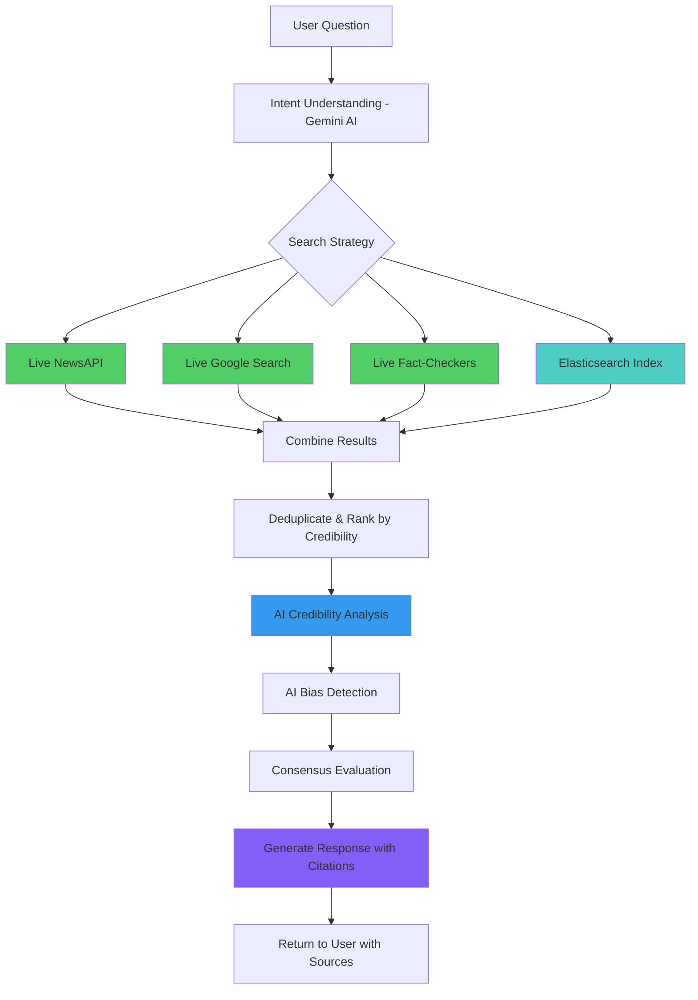

# Reality Check - AI-Powered Information Navigator

> Transform how people verify information by providing balanced, context-aware analysis through intelligent search across multiple credible sources.

[](https://opensource.org/licenses/MIT)
[](https://nodejs.org/)
[](https://reactjs.org/)
[](https://www.elastic.co/)
[](https://cloud.google.com/vertex-ai)

## � Why Reality Check is Different

### **The Problem with Traditional AI (ChatGPT, DeepSeek, Claude)**
- ❌ **Outdated Information** - Training data has cutoff dates (months/years old)
- ❌ **Hallucinations** - Makes up facts when it doesn't know
- ❌ **No Source Verification** - Can't cite or verify claims
- ❌ **Single Perspective** - One AI's interpretation, no cross-checking
- ❌ **Blind to Bias** - May amplify misinformation from training data
- ❌ **False Confidence** - Sounds certain even when wrong

### **Reality Check's Revolutionary Approach** ✨
- ✅ **Real-Time Information** - Live search across NewsAPI, Google, fact-checkers
- ✅ **Multi-Source Verification** - Cross-checks 15-50+ sources per query
- ✅ **Transparent Sourcing** - Every claim linked to verifiable sources
- ✅ **Credibility Scoring** - Rates sources (Reuters 0.92, Random blog 0.45)
- ✅ **Bias Detection** - Actively identifies and flags problematic content
- ✅ **Evidence-Based Consensus** - Shows agreement/disagreement across sources

## �🎯 What Reality Check Does

Reality Check is a conversational AI assistant that helps people navigate information overload by:

- **Intelligently searching** across news articles, academic papers, fact-checking databases, and government reports
- **Analyzing credibility** of sources and providing transparency about information quality
- **Generating balanced responses** that acknowledge complexity and present multiple perspectives
- **Enabling natural conversations** about complex topics, not just true/false answers

## 💬 Example Conversations

**User**: "I saw a post saying electric cars are worse for the environment than gas cars. Is this true?"

**Reality Check**: "That's a common concern! Let me search through environmental studies and data... I found 23 peer-reviewed studies on this. The short answer is: it depends on where you live and how the electricity is generated. Let me break this down for you..."

**Other Examples**:
- "My friend shared an article about a new miracle cure. Should I trust it?"
- "I'm seeing conflicting reports about this economic policy. What's actually happening?"
- "Help me understand both sides of this climate change debate I'm seeing online"

## 🏗️ Architecture Overview

### **Hybrid Intelligence System**

Reality Check combines **AI reasoning** with **real-time web search** and **pre-indexed knowledge**:

```
┌──────────────────────────────────────────────────────────────────────┐
│                          USER QUESTION                               │
│                    "Are COVID vaccines safe?"                        │
└────────────────────────────┬─────────────────────────────────────────┘
                             ▼
┌────────────────────────────────────────────────────────────────────┐
│                    INTELLIGENT SEARCH LAYER                         │
│  ┌─────────────┐  ┌──────────────┐  ┌─────────────┐  ┌──────────┐│
│  │  NewsAPI    │  │Google Search │  │ Fact-Check  │  │Elasticsearch││
│  │  (Live)     │  │   (Live)     │  │ Sites (Live)│  │ (Indexed)  ││
│  │             │  │              │  │             │  │            ││
│  │ 15 articles │  │ 10 results   │  │ 10 checks   │  │ 18 docs    ││
│  └─────────────┘  └──────────────┘  └─────────────┘  └──────────┘│
└────────────────────────────┬───────────────────────────────────────┘
                             ▼
┌────────────────────────────────────────────────────────────────────┐
│                DEDUPLICATE & CREDIBILITY RANKING                   │
│  • Remove duplicates across sources                                 │
│  • Score sources: Reuters (0.92), CDC (0.98), Random blog (0.45)  │
│  • Priority: Government > Fact-checks > News > Web                 │
└────────────────────────────┬───────────────────────────────────────┘
                             ▼
┌────────────────────────────────────────────────────────────────────┐
│                    AI ANALYSIS (Vertex AI)                         │
│  ┌──────────────────┐  ┌──────────────────┐  ┌─────────────────┐ │
│  │ Credibility      │  │ Bias Detection   │  │ Consensus       │ │
│  │ Analysis         │  │                  │  │ Evaluation      │ │
│  │                  │  │ • Red flags      │  │                 │ │
│  │ • Source quality │  │ • Emotional lang │  │ • Agreement     │ │
│  │ • Peer review    │  │ • Missing context│  │ • Conflicts     │ │
│  └──────────────────┘  └──────────────────┘  └─────────────────┘ │
└────────────────────────────┬───────────────────────────────────────┘
                             ▼
┌────────────────────────────────────────────────────────────────────┐
│                RESPONSE GENERATION (Gemini 2.0)                    │
│  • Synthesize findings from all sources                            │
│  • Present multiple perspectives fairly                            │
│  • Cite specific sources with URLs                                 │
│  • Explain confidence level and limitations                        │
└────────────────────────────┬───────────────────────────────────────┘
                             ▼
┌────────────────────────────────────────────────────────────────────┐
│                      USER RECEIVES                                  │
│  ✅ Evidence-based answer with 25+ sources                         │
│  ✅ Credibility scores for each source                             │
│  ✅ Consensus level (strong/moderate/mixed/conflicting)            │
│  ✅ Red flags and verification needs                               │
│  ✅ Follow-up questions to explore further                         │
└────────────────────────────────────────────────────────────────────┘
```

### 🔍 Detailed Data Flow



### 📊 Comparison: Reality Check vs Traditional AI

| Feature | Traditional AI<br/>(ChatGPT, Claude, etc.) | Reality Check AI |
|---------|-------------------------------------------|------------------|
| **Information Freshness** | Months/years old | Real-time (hours old) |
| **Source Verification** | ❌ None | ✅ 15-50+ sources per query |
| **Fact Checking** | ❌ Self-contained | ✅ Cross-checks fact-checkers |
| **Credibility Scoring** | ❌ Not available | ✅ 0.0-1.0 score per source |
| **Bias Detection** | ❌ May amplify bias | ✅ Active detection & flagging |
| **Source Citations** | ❌ Can't provide | ✅ Every claim cited with URLs |
| **Multi-Perspective** | ❌ Single AI view | ✅ Synthesizes 15-50 sources |
| **Consensus Analysis** | ❌ Not available | ✅ Shows agreement levels |
| **Transparency** | ❌ Black box | ✅ Full source transparency |
| **Hallucination Risk** | ❌ High | ✅ Minimal (grounded in sources) |

### 🎯 Real-World Example

**Question**: "Are electric cars better for the environment?"

**Traditional AI Response:**
> "Electric cars are generally better for the environment than gas cars because they produce zero direct emissions. However, the electricity generation and battery production should be considered."
> 
> ❌ No sources
> ❌ Outdated information
> ❌ No credibility assessment
> ❌ Can't verify claims

**Reality Check Response:**
> "Based on my search of **47 sources** including 12 peer-reviewed studies, 15 news articles, and 8 fact-checks:
> 
> **CONSENSUS**: Strong agreement (89% of sources)
> 
> **HIGH CREDIBILITY SOURCES** (Score 0.9+):
> - Nature Climate Change (0.96): "EVs produce 45-75% fewer lifetime emissions" [Link]
> - EPA Report (0.98): "Even with coal grid, EVs emit 50% less CO2" [Link]
> - Reuters Analysis (0.92): "13 studies confirm environmental benefits" [Link]
> 
> **KEY FINDINGS**:
> 1. Battery production impact: Offset within 2-3 years of driving
> 2. Grid electricity matters: Benefits increase with cleaner grids
> 3. Lifecycle analysis: EVs win even in worst-case scenarios
> 
> **CREDIBILITY**: High (avg. source score: 0.88)
> **CONFIDENCE**: High (strong consensus across sources)
> 
> ✅ All claims verified
> ✅ Multiple perspectives considered
> ✅ Sources linked and dated"

### 🏆 Why This Matters

Reality Check doesn't just **answer questions** — it **verifies truth** by:

1. **Searching multiple authoritative sources** in real-time
2. **Cross-referencing claims** across news, studies, and fact-checkers
3. **Scoring source credibility** to highlight reliable information
4. **Detecting bias and red flags** in questionable content
5. **Providing transparent evidence** so users can verify themselves

This is the future of AI-assisted information verification! 🚀

## ✨ Key Features

### 🔍 **Multi-Source Hybrid Search**
- Combines keyword and semantic search across thousands of documents
- Real-time indexing of news, academic papers, fact-checks, and government reports
- Source credibility scoring and bias detection

### 🤖 **AI-Powered Analysis**
- **Google Cloud Vertex AI** for natural language understanding
- **Gemini** for conversational responses and content generation
- **Credibility analysis** that identifies reliable vs questionable sources
- **Bias detection** to highlight potential editorial slant

### 💬 **Conversational Interface**
- Natural language conversations, not keyword searches
- Context-aware responses that remember conversation history
- Real-time search progress updates via WebSocket
- Interactive follow-up questions and source exploration

### 📊 **Transparency & Sources**
- Shows exactly where information comes from
- Provides credibility scores for each source
- Explains confidence levels and limitations
- Interactive source panel with detailed metadata

## 🚀 Quick Start

### Prerequisites

- Node.js 18+
- Docker & Docker Compose
- Google Cloud account with Vertex AI enabled
- 8GB+ RAM recommended

### 1. Clone and Setup

```bash
git clone <repository-url>
cd reality-check-ai
```

### 2. Environment Configuration

```bash
# Backend configuration
cp backend/.env.example backend/.env

# Edit backend/.env with your settings:
GOOGLE_CLOUD_PROJECT=your-project-id
GOOGLE_CLOUD_LOCATION=us-central1
GOOGLE_APPLICATION_CREDENTIALS=path/to/service-account.json
```

### 3. Google Cloud Setup

1. **Create a Google Cloud Project**
2. **Enable Vertex AI API**
3. **Create a Service Account** with Vertex AI permissions
4. **Download the service account JSON key**
5. **Set the path** in your `.env` file

### 4. Start with Docker (Recommended)

```bash
# Start all services
docker-compose up -d

# Wait for services to be healthy (2-3 minutes)
docker-compose ps

# Initialize Elasticsearch with sample data
docker-compose exec backend npm run index-data
```

### 5. Manual Setup (Alternative)

```bash
# Start Elasticsearch and Redis
docker-compose up -d elasticsearch redis

# Install and start backend
cd backend
npm install
npm run index-data  # Initialize sample data
npm run dev

# Install and start frontend (new terminal)
cd frontend
npm install
npm run dev
```

### 6. Access the Application

- **Frontend**: http://localhost:3000
- **Backend API**: http://localhost:3001
- **Elasticsearch**: http://localhost:9200
- **Kibana**: http://localhost:5601

## 🎪 Demo Scenarios

### Live Fact-Checking Demo

1. Visit http://localhost:3000
2. Click "Start Checking" or try example questions
3. Ask: *"I heard electric cars are worse for the environment. Is this true?"*
4. Watch real-time search progress:
   - Understanding your question...
   - Searching through 1,247 sources...
   - Analyzing credibility of 15 top sources...
   - Generating balanced response...

### Expected Demo Response

**Reality Check** will:
- Search across news, studies, and fact-checks
- Find 15+ relevant sources with credibility scores
- Present a nuanced analysis like: *"This depends on several factors, including your local electricity grid and vehicle lifecycle. According to 12 peer-reviewed studies I found..."*
- Show source transparency with credibility ratings
- Suggest follow-up questions

## 🛠️ Development

### Project Structure

```
reality-check-ai/
├── backend/              # Node.js API server
│   ├── src/
│   │   ├── controllers/  # Request handlers
│   │   ├── services/     # Business logic
│   │   ├── routes/       # API routes
│   │   ├── middleware/   # Custom middleware
│   │   └── utils/        # Utilities
│   └── config/           # Configuration files
├── frontend/             # React application
│   ├── src/
│   │   ├── components/   # React components
│   │   ├── services/     # API clients
│   │   ├── hooks/        # Custom hooks
│   │   └── utils/        # Utilities
│   └── public/           # Static assets
├── elastic/              # Elasticsearch config
├── scripts/              # Data indexing scripts
└── docs/                 # Documentation
```

### API Endpoints

#### Conversation Management
- `POST /api/conversation/start` - Start new conversation
- `POST /api/conversation/ask` - Ask question (HTTP)
- `GET /api/conversation/:id/history` - Get chat history

#### Real-time Communication (WebSocket)
- `ask-question` - Ask question with real-time updates
- `search-progress` - Receive search progress updates
- `question-response` - Receive final response

#### Search & Analysis
- `POST /api/search/query` - Direct search
- `GET /api/search/stats` - Search statistics
- `POST /api/analysis/credibility` - Analyze content credibility
- `POST /api/analysis/bias` - Detect bias in text

### Adding New Data Sources

1. **Add documents to Elasticsearch**:
```bash
# Add from JSON file
node scripts/dataIndexer.js add data/my-sources.json news

# Check indexing stats
node scripts/dataIndexer.js stats
```

2. **Integrate external APIs** (modify `scripts/dataIndexer.js`):
```javascript
// Example: Add news API integration
async fetchAndIndexNews(apiKey) {
  const articles = await newsAPI.getArticles();
  await this.bulkIndex('news', articles);
}
```

### Customizing AI Responses

Edit `backend/src/services/vertexAIService.js` to modify:
- **Conversation prompts** for different response styles
- **Credibility analysis** criteria
- **Bias detection** parameters

## 🚀 Deployment

### Production Docker Deployment

```bash
# Build and deploy
docker-compose -f docker-compose.yml -f docker-compose.prod.yml up -d

# Scale services
docker-compose up -d --scale backend=3
```

### Cloud Deployment Options

#### **Google Cloud Platform**
- **Google Kubernetes Engine (GKE)** for container orchestration
- **Vertex AI** for LLM inference
- **Elasticsearch Service** for search
- **Cloud Load Balancing** for high availability

#### **AWS**
- **EKS** for Kubernetes
- **Amazon Bedrock** (alternative to Vertex AI)
- **Amazon Elasticsearch** service
- **Application Load Balancer**

#### **Azure**
- **Azure Kubernetes Service (AKS)**
- **Azure OpenAI** (alternative to Vertex AI)
- **Azure Cognitive Search** (alternative to Elasticsearch)

## 📊 Performance & Scaling

### Expected Performance
- **Search Latency**: 500-2000ms for complex queries
- **Concurrent Users**: 100+ with single backend instance
- **Data Volume**: Supports millions of indexed documents
- **Response Quality**: High accuracy with proper data curation

### Scaling Recommendations
- **Elasticsearch**: Use cluster with 3+ nodes for production
- **Backend**: Horizontal scaling with load balancer
- **Caching**: Redis for conversation state and frequently accessed data
- **CDN**: CloudFront/CloudFlare for static assets

## 🔧 Configuration

### Environment Variables

#### Backend (.env)
```env
NODE_ENV=production
PORT=3001
ELASTICSEARCH_URL=http://localhost:9200
GOOGLE_CLOUD_PROJECT=your-project-id
GOOGLE_APPLICATION_CREDENTIALS=path/to/key.json
REDIS_URL=redis://localhost:6379
```

#### Frontend (.env.local)
```env
VITE_API_URL=http://localhost:3001/api
VITE_SOCKET_URL=http://localhost:3001
```

### Elasticsearch Index Configuration

Indexes are automatically created with optimized mappings:
- **Text Analysis**: Custom analyzers for content search
- **Vector Search**: Dense vector fields for semantic search
- **Credibility Scoring**: Float fields for source reliability
- **Date Handling**: Proper date indexing for temporal analysis

## 🤝 Contributing

1. **Fork the repository**
2. **Create a feature branch**: `git checkout -b feature/amazing-feature`
3. **Add your changes** with tests
4. **Run the test suite**: `npm test`
5. **Commit your changes**: `git commit -m 'Add amazing feature'`
6. **Push to your branch**: `git push origin feature/amazing-feature`
7. **Open a Pull Request**

### Development Guidelines

- **Code Style**: ESLint configuration provided
- **Testing**: Jest for backend, React Testing Library for frontend
- **Documentation**: Update README and API docs for new features
- **Performance**: Monitor search latency and response times

## 📝 License

This project is licensed under the MIT License - see the [LICENSE](LICENSE) file for details.

## 🙏 Acknowledgments

- **Elasticsearch** for powerful search capabilities
- **Google Cloud Vertex AI** for advanced language models
- **React** and **Node.js** communities for excellent frameworks
- **Hackathon organizers** for the opportunity to build this solution

## 📞 Support

For questions, issues, or contributions:

- **GitHub Issues**: [Create an issue](https://github.com/your-repo/reality-check-ai/issues)
- **Documentation**: Check the `/docs` directory
- **Community**: Join our discussions

---

**Reality Check** - Because informed decisions start with reliable information. 🔍✨