# Architecture Documentation

## System Overview

Reality Check AI uses a **hybrid intelligence architecture** combining real-time search, pre-indexed data, and AI analysis for information verification.

## System Architecture Diagram

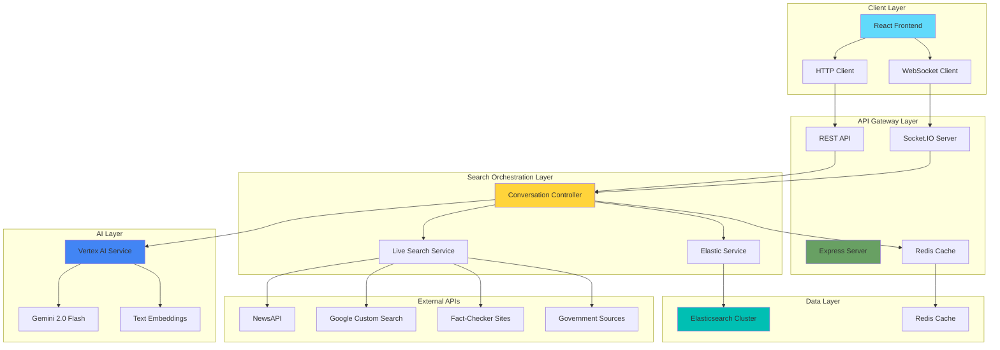

##  Complete Request Flow Sequence Diagram

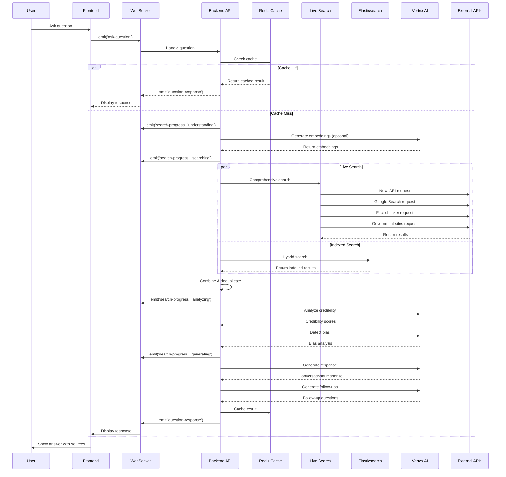

##  Data Flow Architecture

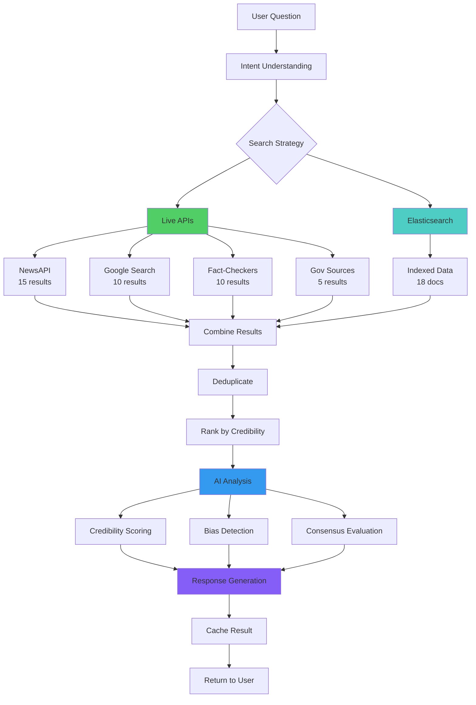

## Search Architecture Pattern

### Hybrid Search Strategy

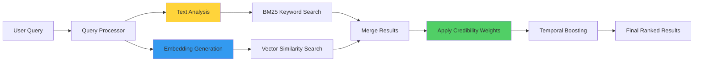

### Search Index Structure

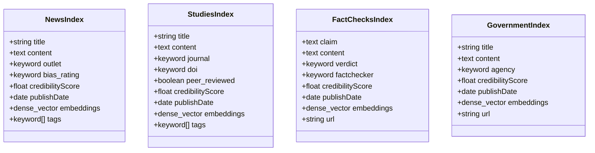

##  Design Patterns

### 1. Strategy Pattern - Search Strategy

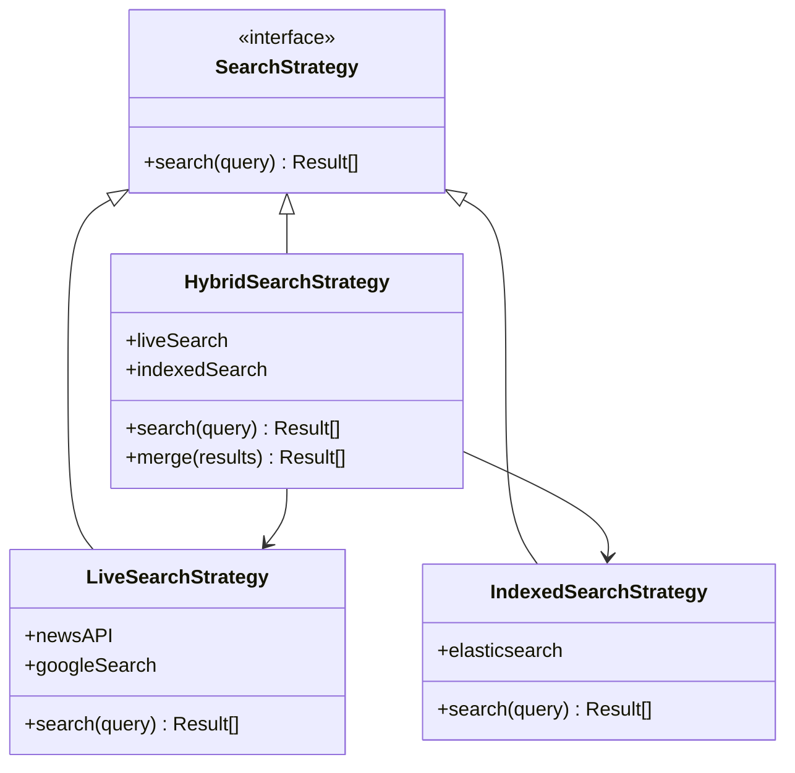

### 2. Observer Pattern - Real-time Updates

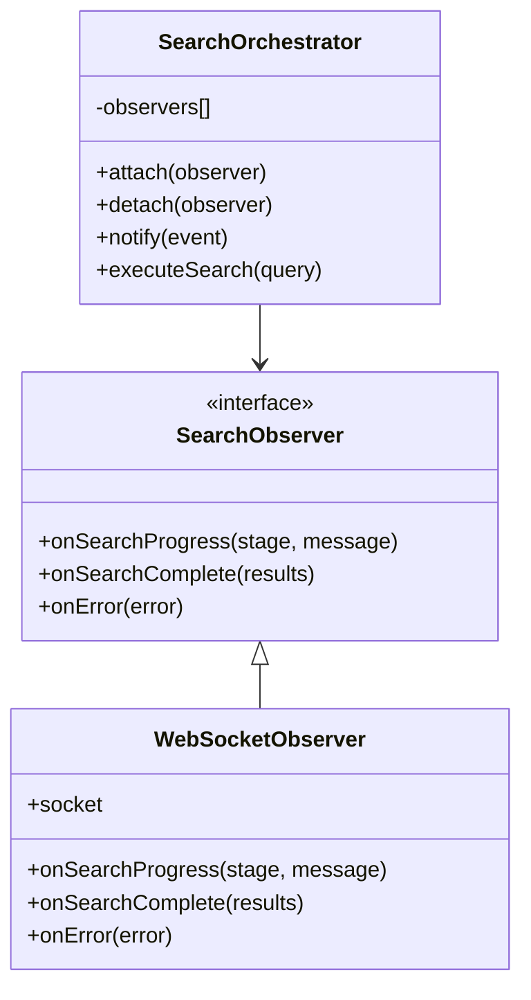

### 3. Factory Pattern - AI Service Creation

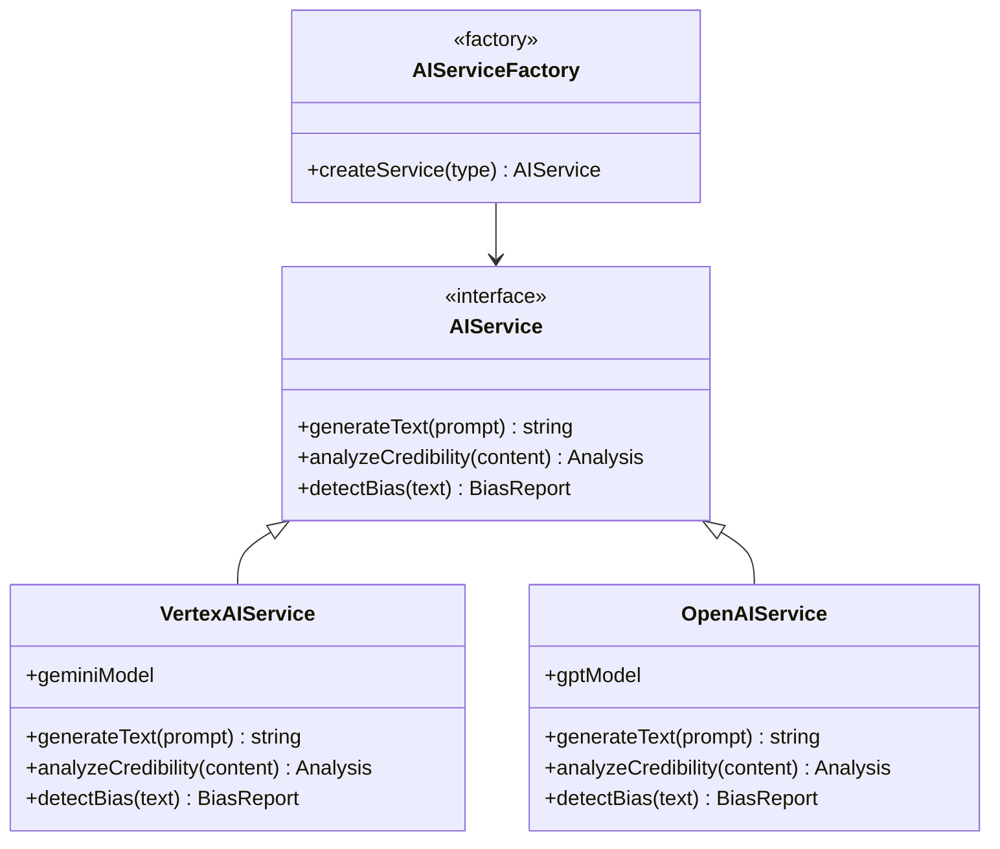

### 4. Chain of Responsibility - Content Processing

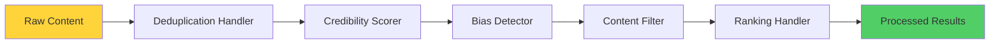

##  Component Interaction Diagram

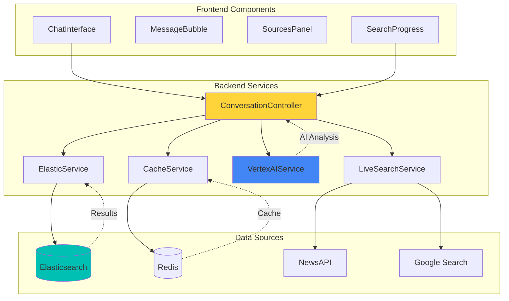

##  State Machine - Conversation Flow

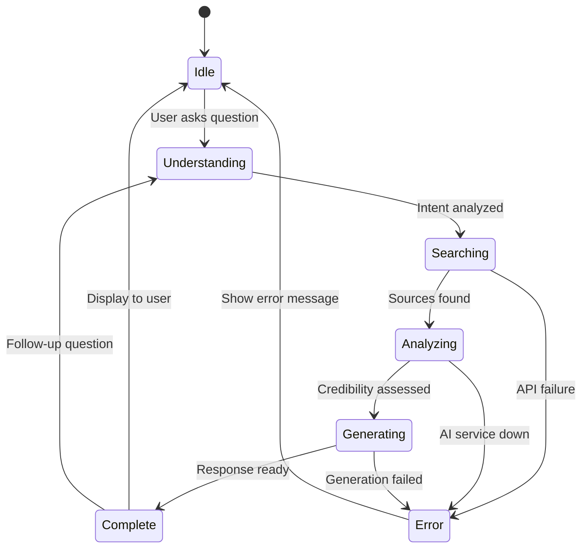

##  Caching Strategy

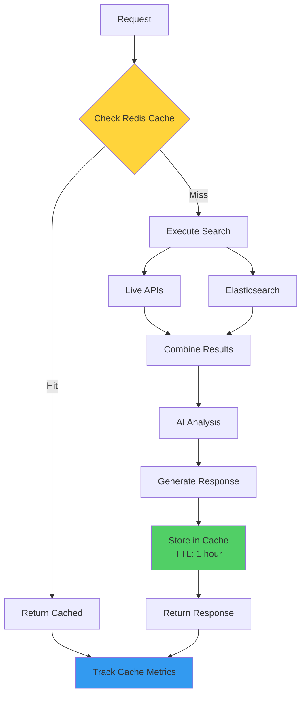

## Deployment Architecture

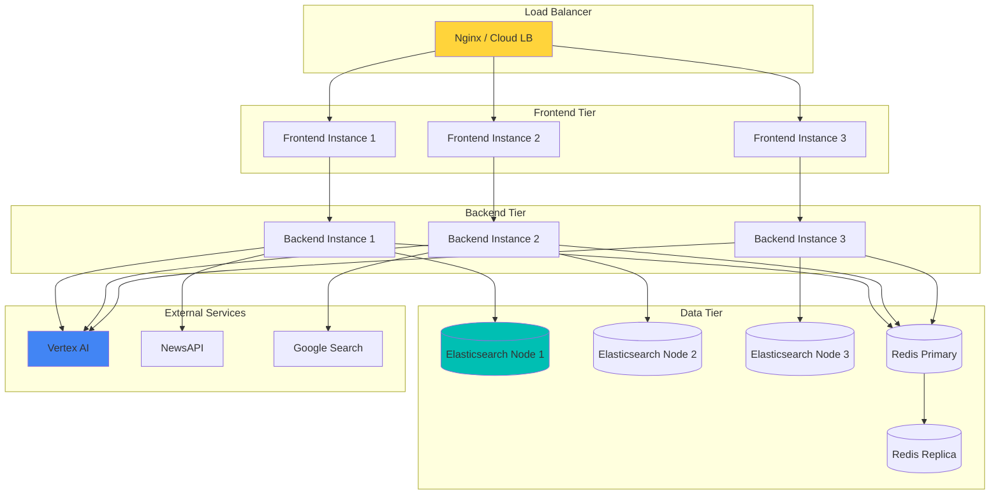

##  Performance & Monitoring

### System Metrics Flow

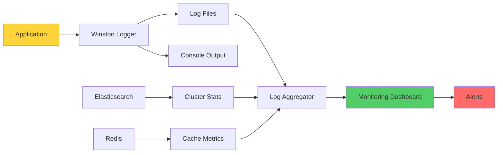

### Performance Targets

| Component | Target | Monitoring |
|-----------|--------|------------|
| Search Latency | < 2s | P95 response time |
| AI Response | < 5s | P95 generation time |
| Cache Hit Rate | > 70% | Redis stats |
| API Availability | > 99% | Health checks |
| Concurrent Users | 100+/instance | Connection count |

##  Security Architecture

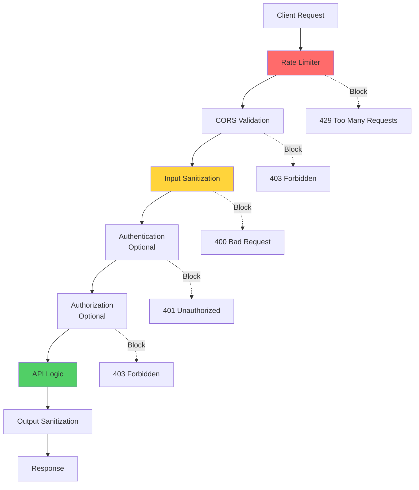

